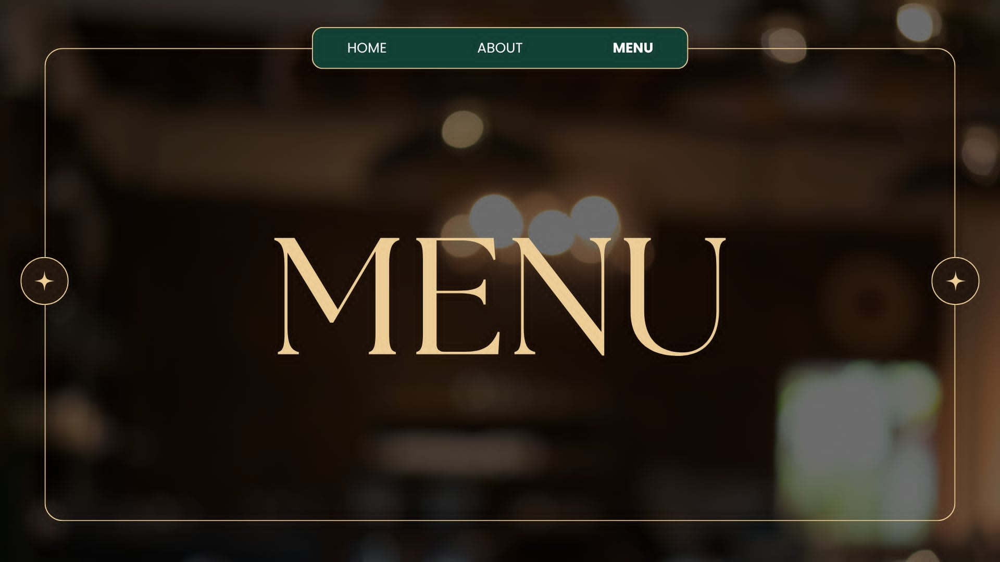
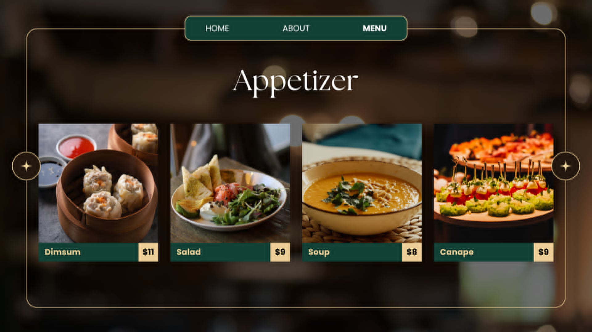
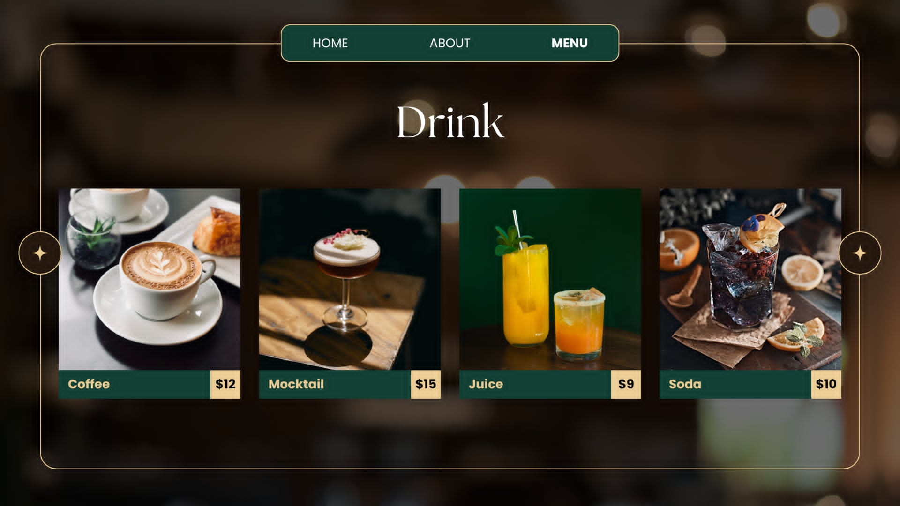
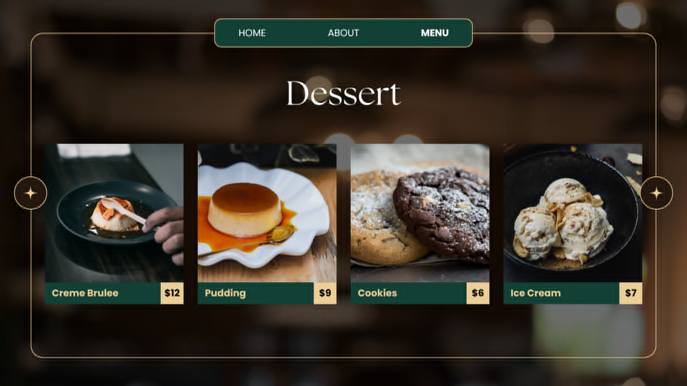
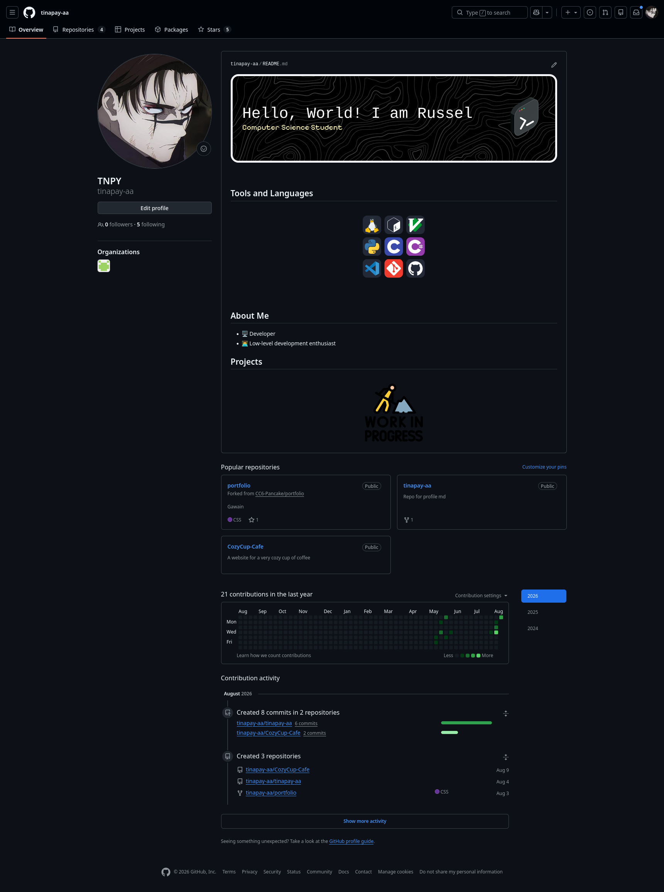
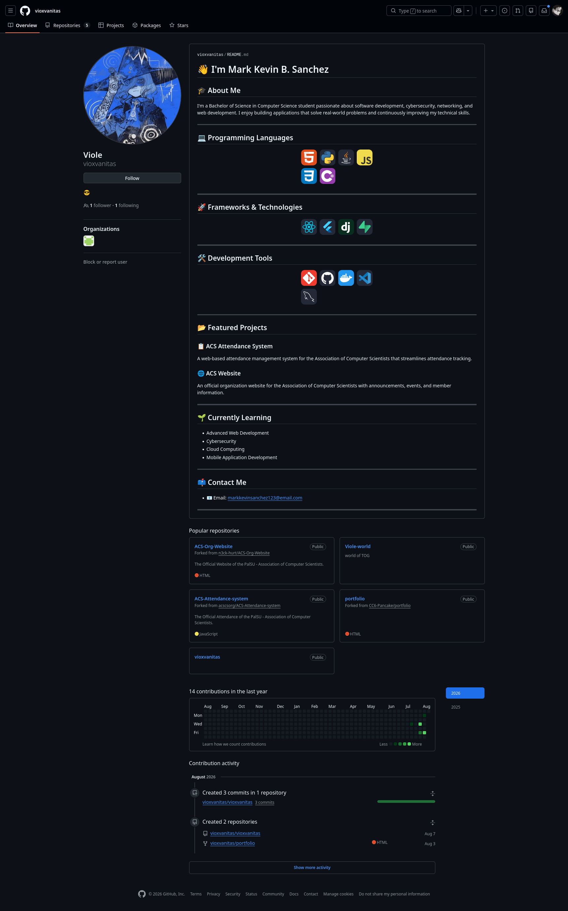

# Project Description
A cozy project for a cozy cup of coffee.  
This project will showcase a virtual cafe where people can chill out, enjoy a cup of joe, hangout, or even stress out for an upcomming test! Either way, everyone is welcome to cozy up!

# Features
- Place orders
- Check opening hours

# Screen Captures

This is the landing page, where users will feel the warmth of our service :D

 

This is the store ours page, where our customers can see our openning hours!

 

 

This is our menu page! Where customers can see all our deliciously cozy foods and drinks

# About the Authors
  

<b><a href="https://www.facebook.com/srstl26">Russel Aaron A. Sarastal</a></b>  
<b><a href="https://github.com/tinapay-aa">202480113@psu.palawan.edu.ph</a></b>

---

 
  

 <b><a href="https://www.facebook.com/mark.kevin.sanchez.802260">Mark Kevin B. Sanchez</a></b>  
<b><a href="https://github.com/vioxvanitas">202480124@psu.palawan.edu.ph</a></b>

---
